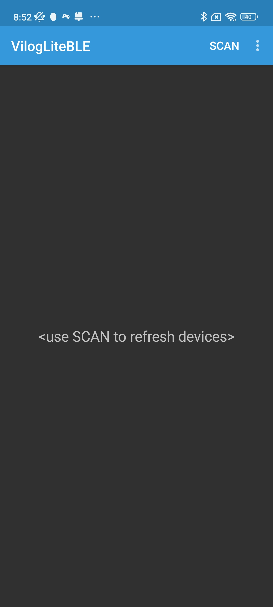
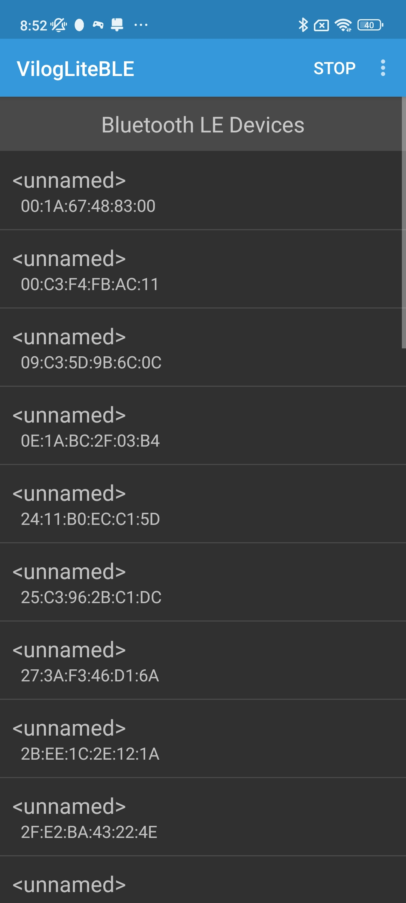
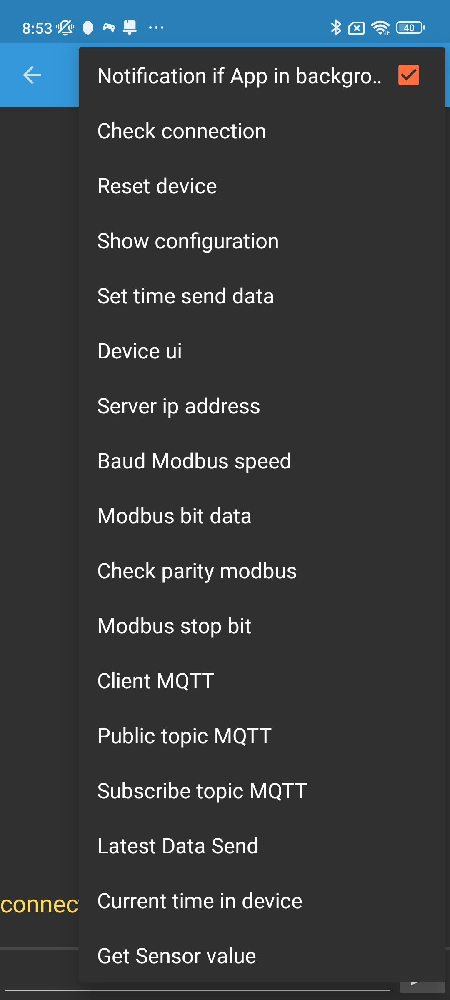

# Vilog Lite Terminal BLE User Guide

### Step 1: Open the VilogLiteBLE app on your mobile device.

### Step 2: Tap **SCAN** to search for Vilog devices via Bluetooth.

- If Bluetooth is disabled, tap the three-dot menu (next to SCAN) and select **Bluetooth Settings** to enable it.  
  

### Step 3: Select a scanned device to configure.

- The app will navigate to the command entry screen.  
  

### Step 4: Configure the device.

- Enter a command manually or tap the three-dot menu to choose from preset commands.  
  
